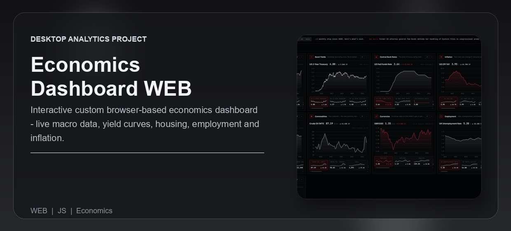
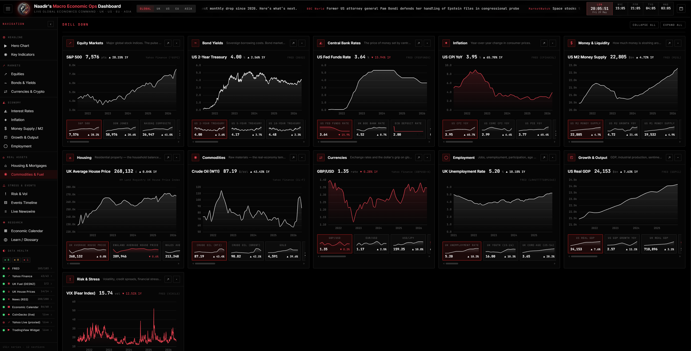
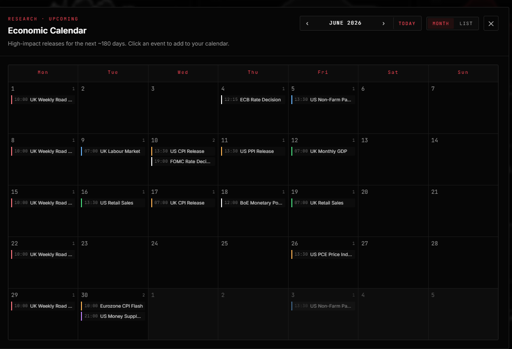
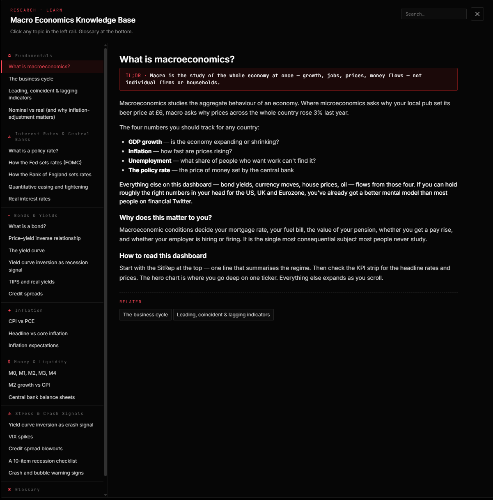

<div align="center">


<br /><br />

<p><strong>Interactive browser-based economics dashboard — live macro data, yield curves, housing, employment and inflation. Currently in development.</strong></p>

<p>Built for individuals who want a Bloomberg-terminal-style read on the UK and global economy without the Bloomberg subscription — and as an open reference for anyone building their own data-driven dashboards.</p>

<p>
  <a href="#overview">Overview</a> |
  <a href="#what-problem-it-solves">What It Solves</a> |
  <a href="#feature-highlights">Features</a> |
  <a href="#screenshots">Screenshots</a> |
  <a href="#quick-start">Quick Start</a> |
  <a href="#tech-stack">Tech Stack</a>
</p>

<h3><strong>Made by Naadir | May 2026</strong></h3>

</div>

---

## Overview

A single-page dashboard that pulls together more than 160 macro time series — equity indices, bond yields, central bank rates, inflation, money supply, housing, commodities, FX, employment, GDP and risk indicators — and renders them in one cohesive UK-first view. The data refreshes itself on a schedule, the page hosts as static files, and there is no backend to run.

One GitHub Actions workflow runs a full data refresh twice daily and news/calendar refreshes hourly. It uses FRED, Yahoo, ONS, BIS, BoE, ECB, Eurostat, Land Registry and DESNZ, validates observations, commits JSON and explicitly checks Pages publication. The browser defaults to an interactive stored-data archive, with optional live quotes and TradingView feeds.

The practical outcome: instead of opening five different sites to check the macro picture — FRED for inflation, Yahoo for the FTSE, the Bank of England PDF for the next MPC, gov.uk for fuel prices, the Land Registry for house prices — everything sits on one page with a coherent narrative, an interactive event timeline, downloadable CSVs, an economic calendar that exports to Google or Outlook, and an in-app glossary for when the terminology gets in the way.

## What Problem It Solves

- Removes the tab-juggling between FRED, Yahoo Finance, ONS, gov.uk, the Bank of England and the ECB just to assemble a coherent macro picture.
- Refreshes data automatically while exposing source failures, retained observations and reporting lag. External APIs can still require maintenance.
- Closes the visibility gap on UK regional housing — most public dashboards stop at "UK average" while Land Registry already publishes 14 distinct regions back to 1968.
- Compared with subscription tools (Bloomberg, Refinitiv, Trading Economics) it costs nothing, runs in any browser, and the code is fully auditable; compared with hand-rolling the same in Excel it stays current without anybody touching it.

### At a glance

| Track | Analyse | Compare |
|---|---|---|
| 166 economic and market series | Interactive archive with daily market history, zoom, pan, date ranges and annotations | UK, US and international comparisons with explicit reporting periods |
| Timestamped market snapshots and optional browser quotes for five crypto assets | RSS newswire and published release calendars | UK unemployment with correctly labelled age and gender breakdowns |
| Per-source data-health panel showing last-fetch age, delivered/expected counts and runtime status | Auto-generated economic calendar covering the next 12 months of FOMC, BoE, ECB, NFP, CPI, PCE, retail and UK labour releases | "as of [date]" stamp on every chart so the publication lag of each source is always visible |

## Feature Highlights

- **Timestamped market tiles**, with stored snapshots and optional quotes that show the provider timestamp and degrade visibly when a feed is unavailable.
- **166 series with provenance**, including reporting periods, publication metadata where available, source-specific transformations and individual freshness checks.
- **Interactive event timeline pinned to the chart**, 42 historical economic events (1971 Nixon Shock through 2025 tariffs) plus auto-promoted current events from the live news feed, each one clickable to draw a vertical annotation on the hero chart.
- **Published-date economic calendar**, fetched from official Fed, BoE, ECB, BLS, BEA, ONS and Census schedules. Provisional/cached dates remain labelled; unannounced dates are not estimated.
- **Per-source health dashboard**, showing current deliveries, overdue observations, retained data and source-level issues. Historical-only series are separate.
- **Built-in glossary and knowledge base**, 5 categories of macro education content (Fundamentals, Rates, Bonds, Inflation, Money, Stress Signals) plus a 60-term A-Z glossary, searchable in-app — for when "OAS spread" or "M2 YoY" needs explaining.
- **CSV export on every chart**, downloads the currently-focused series with commented-metadata headers and the most granular data the source provides.

### Core capabilities

| Area | What it gives you |
|---|---|
| **Markets** | Live + historical data for equity indices, bond yields, commodities, FX and crypto; TradingView hero chart with full intraday granularity; symbol switcher for 60+ instruments. |
| **Macro** | Inflation, rates, money supply, GDP and employment with UK + US age-bracket and gender splits; countdown timers to the next FOMC / BoE / ECB / NFP / CPI release. |
| **Housing** | UK average house prices and 13 regional breakdowns (London, South East, etc.) back to April 1968 from HM Land Registry, plus weekly UK pump petrol and diesel prices from DESNZ. |
| **Research** | Hand-curated 1971-2025 event timeline; auto-extending calendar exporting to Google/Outlook/.ics; in-app glossary; per-chart CSV download; full data-source health monitor. |

## Screenshots

<details>
<summary><strong>Open screenshot gallery</strong></summary>

<br />

<div align="center">
  
  <br /><br />
  
  <br /><br />
  
</div>

</details>

## Quick Start

```bash
# Clone the repo
git clone https://github.com/Naadir-Dev-Portfolio/Economics-Dashboard-Web.git
cd Economics-Dashboard-Web

# Install Python dependencies (for the data fetchers — only needed if running locally)
pip install -r scripts/requirements.txt

# Seed the data files (one-off; the GitHub Action does this on its schedule)
export FRED_API_KEY="your_key_here"           # macOS / Linux
$env:FRED_API_KEY = "your_key_here"            # PowerShell
python scripts/fetch_data.py
python scripts/fetch_news.py
python scripts/fetch_calendar.py
python scripts/build_health.py
python scripts/validate_data.py

# Serve the static site
python -m http.server 8000
# open http://localhost:8000
```

The dashboard uses static files served over HTTP: `index.html`, `assets/` and `data/*.json`. The FRED API key is used only by the Python fetcher; public CSV is a fallback. See [SETUP.md](SETUP.md) for Actions/Pages operations and [DATA_SOURCES.md](DATA_SOURCES.md) for provenance, reporting lags and failure handling.

## Tech Stack

<details>
<summary><strong>Open tech stack</strong></summary>

<br />

| Category | Tools |
|---|---|
| **Primary stack** | `HTML. Javascript` | `CSS` | `Python` |
| **UI / App layer** | Vanilla HTML/CSS/JS — no framework, no build step. Apache ECharts for category and KPI charts, TradingView embedded widget for the hero chart, custom CSS-grid layout with covert-ops dark theme and full mobile responsive pass. |
| **Data / Storage** | Static JSON files in `data/` committed back to the repo on each refresh. No database. Per-section, per-source files plus `manifest.json`, `events.json`, `news.json`, `calendar.json`, `health.json` and `education.json`. |
| **Automation / Integration** | GitHub Actions cron (every hour for news, twice daily for full refresh); FRED REST API; `yfinance` library (Yahoo Finance); HM Land Registry full-file CSV scrape; gov.uk DESNZ weekly fuel CSV scrape; ONS direct time-series API; federalreserve.gov FOMC calendar scrape; RSS aggregator pulling from 14 news sources; optional CoinGecko REST quotes with bounded retries; TradingView embedded widget. |
| **Platform** | Web — hosted on GitHub Pages (cross-platform browser). Mobile-first responsive layout down to 375px viewport. |

</details>

## Architecture & Data

<details>
<summary><strong>Open architecture and data details</strong></summary>

<br />

### Application model

The workflow runs primary full-data refreshes at 06:37 and 18:37 UTC, with news/calendars at minute 7 each hour. Health-aware checks at 08:23 and 20:23 UTC recover a delayed or dropped primary schedule: they perform a full fetch only when the last full manifest is more than eight hours old or reports failed/stale series. This stagger avoids GitHub's busiest minute-zero window. Every run executes regression tests, validates artifacts, commits data and explicitly publishes Pages. Source-quality failures are reported after valid updates are published.

In the browser, `main.js` loads static JSON. Hero and category panels share a local ECharts renderer with bounded dates, vertical grids, zoom and pan. The hero normalizes wheel input to small cursor-anchored steps. Its optional RSI(14), SMA(20) and SMA(50) use full native-frequency history, including observations before the visible range; zooming never changes the indicator periods. RSI has a synchronized 0-100 lower pane. Indicator choices persist locally, initially off. Every selector, tile and drill-down uses the exact section/series identity. Economic series keep their native frequency; optional TradingView feeds are separate. ECharts, Lucide and `technicalindicators` 3.1.0 are pinned local bundles with licenses.

Scheduled-data health is separate from optional browser feeds. BIS policy-rate observations are daily but [published weekly](https://data.bis.org/topics/CBPOL?m=237), so those four series have a 14-day observation-age allowance; the 36-hour successful-refresh check remains in force. Browser freshness uses the same calendar-day boundaries as Python. Health and news periodically re-fetch published snapshots instead of ageing an indefinitely cached response. CoinGecko polls once per minute while visible and backs off on rate limits or invalid quotes. Yahoo market tiles use the Actions snapshots, not unreliable anonymous CORS proxies. A grey TradingView state means the live chart has not been opened or has been closed; an embedded iframe cannot verify its quote feed. Market-clock colours represent regular weekday sessions, including Tokyo/Hong Kong lunch breaks, not exchange holiday or special-session calendars.

### Project structure

```text
Economics-Dashboard-Web/
+-- index.html                      Single-page dashboard
+-- assets/
|   +-- css/main.css                Dark-theme stylesheet + responsive breakpoints
|   +-- js/                         12 modules — one per panel/feature
|   |   +-- main.js                 Boot + orchestration
|   |   +-- data-loader.js          Cached JSON fetcher
|   |   +-- hero.js                 TradingView widget + archive overlay
|   |   +-- kpi.js                  Headline carousel + release countdowns
|   |   +-- live-prices.js          CoinGecko polling / scheduled market snapshots
|   |   +-- charts.js               ECharts factory
|   |   +-- category.js             Drill-down matrix + CSV export
|   |   +-- ribbon.js               Auto-scrolling sparkline strip
|   |   +-- news.js                 RSS feed + top-bar ticker
|   |   +-- events-timeline.js      Interactive annotations
|   |   +-- calendar-modal.js       Month grid + .ics export
|   |   +-- education-modal.js      Glossary / knowledge base
|   |   +-- health-panel.js         Per-source status sidebar
|   |   +-- clocks.js               Multi-zone world clocks
|   +-- img/logo.png                Lion logo (favicon + topbar + boot screen)
+-- data/                           Auto-regenerated each refresh
|   +-- manifest.json               Section index + last-refresh stamp
|   +-- markets.json, bonds.json,   One file per category
|   |   rates.json, inflation.json,
|   |   money.json, housing.json,
|   |   commodities.json, fx.json,
|   |   employment.json, macro.json,
|   |   risk.json
|   +-- events.json                 Historical curated event timeline
|   +-- news.json                   200 latest aggregated RSS items
|   +-- calendar.json               Next 12 months of economic events
|   +-- health.json                 Per-source status snapshot
|   +-- education.json              Glossary + knowledge base
+-- tests/                          Data, calendar, JavaScript and browser regressions
+-- scripts/
|   +-- series_config.py            Declarative list of every series
|   +-- fetch_data.py               Main data pipeline
|   +-- fetch_news.py               RSS aggregator
|   +-- fetch_calendar.py           Economic-calendar builder + FOMC scraper
|   +-- build_health.py             Health snapshot generator
|   +-- data_quality.py             Validation, freshness and calendar-based statistics
|   +-- source_providers.py         Structured official-source adapters
|   +-- validate_data.py            Publication gate and Actions health summary
|   +-- refresh_committee_dates.py  Compatibility alias for automatic calendar refresh
|   +-- requirements.txt            requests, pandas, yfinance, python-dateutil
+-- .github/workflows/update-data.yml   Cron + commit-back workflow
+-- README.md                       This file
+-- SETUP.md                        GitHub Actions / Pages setup walkthrough
+-- DATA_SOURCES.md                 Per-pipeline reliability catalogue
+-- repo-card.png
+-- portfolio/
    +-- economics-dashboard-web.json
    +-- Screen1.png
    +-- Screen2.png
    +-- Screen3.png
```

### Data / system notes

- All data persists as plain JSON in the repository — no database, no server-side state. The pipeline is `git`-native: each refresh is a commit, history is a complete audit trail of how the dashboard's view of the world changed over time.
- The only credential the system uses is the FRED API key, stored as a GitHub repository secret (`FRED_API_KEY`) and injected only into the Action runner environment. It is never written to disk, never sent to the browser, and never appears in committed code. Every other data source is anonymous.
- Charts show reporting periods, native frequency and data quality. Refresh timestamps do not imply a new economic release. Calendar dates are automatic, but source changes and persistent outages can still need attention.

</details>

## Contact

Questions, feedback, or collaboration: `naadir.dev.mail@gmail.com`

<sub>HTML. Javascript | CSS | Python</sub>
